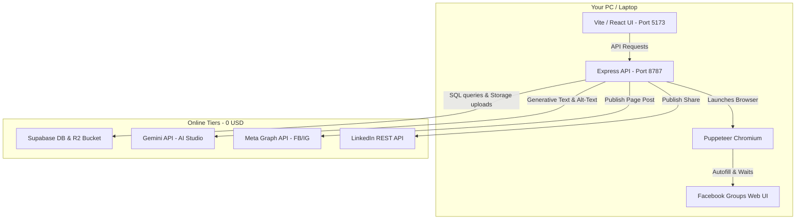

# Full Backend Plan & PRD: Glitch Broadcast

This document is the master specification, Product Requirements Document (PRD), architectural guide, local deployment handbook, and user operations manual for **Glitch Broadcast**. It outlines how to run this software entirely on local hardware for free.

---

## 1. Product Requirements Document (PRD)

### 1.1 Product Overview
**Glitch Broadcast** is a private, local-first social media distribution command center built for a solo developer and algorithmic trader under the **Glitch EnterPrice** brand.
* **Core Problem**: Writing updates for multiple social platforms requires manual rewriting to match tones, hashtags, and format limitations. Furthermore, Meta's Graph API bans third-party applications from posting directly to arbitrary Facebook Groups, creating an automation gap.
* **The Solution**: A local-first workspace. Write content once, send it to a local Gemini instance to adapt per platform, and automatically broadcast it via official Graph APIs (LinkedIn, Facebook Pages, Instagram Business). For Facebook Groups, run a headed (visible) local Chromium instance via Puppeteer to autofill inputs and await a manual final confirmation click.

### 1.2 Core Target Stack & Hosting Costs
To keep hosting costs at **exactly $0.00 / month**, the application utilizes local resources and generous cloud free tiers:
1. **Frontend**: React (Vite) + Tailwind CSS. Hosted locally on `localhost:5173`.
2. **Backend**: Node.js + Express API. Hosted locally on `localhost:8787` (runs on your local PC).
3. **Database**: Supabase PostgreSQL. Hosted on the **Supabase Free Tier** (500MB database, 1GB file storage, 100% free).
4. **AI Generation**: Google Gemini 2.5 Flash. Generates variants via the **Google AI Studio Free Tier** (15 RPM / 1,500 RPD, 100% free).
5. **Assisted Posting Browser**: Native Chromium launched locally via **Puppeteer** utilizing your active local Chrome profiles.

### 1.3 The 7 Functional Modules
1. **Command Center**: The primary control dashboard. Displays scheduled queues, connection statuses (active pings), growth index charts, and recent broadcast event logs.
2. **AI Chat**: Monospace developer interface to brainstorm content ideas, draft disclaimers, or convert developer logs into social posts using Gemini.
3. **Content Vault**: A digital asset folder explorer (`general`, `brand-assets`, `product-shots`, `trading-charts`, `drafts`) supporting drag-and-drop file uploads. Includes a Gemini-powered Alt-Text auto-writer.
4. **Composer**: The core composer. Write base text, attach image files, select a brand voice preset (e.g., *Nigerian Slang Chill* or *Quant Spec*), check target channels, and adapt variants. Includes inline editing, character limit warnings, and A/B test variations switcher.
5. **Scheduler**: A visual weekly calendar column manager. Drag, reschedule, force publish, or delete scheduled posts.
6. **Groups (Assisted)**: Facebook Group pipeline with an integrated terminal emulation console. Opens Chrome, loads cookies, navigates to target groups, types text, uploads images, and logs browser status live.
7. **Settings**: Central diagnostics tab to test environment variables, check API pings, and view documentation.

---

## 2. System Architecture & Flows

### 2.1 High-Level Architecture Diagram



### 2.2 Database Schema Relations
```
+---------------+        +------------------+        +--------------------------+
|     posts     |        |  post_variants   |        | assisted_posting_queue   |
|---------------|        |------------------|        |--------------------------|
| id (PK)       | <----+ | id (PK)          | <----+ | id (PK)                  |
| title         |        | post_id (FK)     |        | post_variant_id (FK)     |
| base_content  |        | platform         |        | group_url                |
| status        |        | content          |        | status                   |
| scheduled_for |        | hashtags         |        | log                      |
| created_at    |        | media_ids        |        | created_at               |
+---------------+        | publish_status   |        | updated_at               |
                         | platform_post_id |        +--------------------------+
                         | posted_at        |
                         +------------------+
```

---

## 3. Detailed Manual Tasks

### 3.1 Setup Meta Developer App (Facebook Page & Instagram)
Meta permissions require long-lived page access tokens. Short-lived tokens expire in 2 hours.
1. Navigate to **developers.facebook.com** and log in.
2. Click **Create App** ➡️ Select **Other** ➡️ **Business** App Type. Name it "Glitch Broadcast".
3. Inside your App Dashboard, add **Facebook Login for Business** and **Instagram Graph API**.
4. Go to **Tools ➡️ Graph API Explorer**:
   - Select your App.
   - Under **User or Page**, select your Facebook Page.
   - Add permissions: `pages_manage_posts`, `pages_read_engagement`, `instagram_basic`, `instagram_content_publish`.
   - Click **Generate Access Token**. Copy this short-lived token.
5. **Get Long-Lived User Access Token** (lasts 60 days):
   Execute this HTTP GET request in your browser or postman (replace brackets with actual values):
   ```
   https://graph.facebook.com/v20.0/oauth/access_token?
       grant_type=fb_exchange_token&
       client_id={your-meta-app-id}&
       client_secret={your-meta-app-secret}&
       fb_exchange_token={your-short-lived-token}
   ```
   Copy the `access_token` returned in the JSON payload.
6. **Get Long-Lived Page Access Token** (never expires):
   Use that 60-day token to query Facebook Pages:
   ```
   https://graph.facebook.com/v20.0/me/accounts?access_token={your-60-day-user-token}
   ```
   Find your Facebook Page name in the list, copy the corresponding `access_token`. This is your `META_PAGE_ACCESS_TOKEN`.
7. **Get Connected Instagram Business Account ID**:
   Query the page ID to locate the Instagram node:
   ```
   https://graph.facebook.com/v20.0/{your-facebook-page-id}?fields=instagram_business_account&access_token={your-page-access-token}
   ```
   Copy the ID under `instagram_business_account`. This is your `META_IG_BUSINESS_ACCOUNT_ID`.

### 3.2 Setup LinkedIn Developer App
1. Go to **linkedin.com/developers/apps** and create an app. Link it to an active LinkedIn Company Page.
2. Under the **Products** tab, request access to:
   - **Share on LinkedIn** (provides `w_member_social` permission).
3. Go to **Auth** tab. Copy **Client ID** and **Client Secret**.
4. Add a redirect URL: `http://localhost:8787/api/auth/linkedin/callback` (or a mock local callback).
5. **Run OAuth redirect code request**:
   Navigate to this URL in your web browser:
   ```
   https://www.linkedin.com/oauth/v2/authorization?response_type=code&client_id={your-client-id}&redirect_uri=http://localhost:8787/api/auth/linkedin/callback&state=glitchState&scope=w_member_social
   ```
   Approve the prompt. Copy the returned `code` parameter from the URL address bar.
6. **Exchange for LinkedIn Access Token** (lasts 60 days):
   Execute this POST request using Postman or cURL:
   ```bash
   curl -X POST https://www.linkedin.com/oauth/v2/accessToken \
     -H "Content-Type: application/x-www-form-urlencoded" \
     -d "grant_type=authorization_code" \
     -d "code={copied-code-parameter}" \
     -d "redirect_uri=http://localhost:8787/api/auth/linkedin/callback" \
     -d "client_id={your-client-id}" \
     -d "client_secret={your-client-secret}"
   ```
   Copy the `access_token` returned. This is your `LINKEDIN_ACCESS_TOKEN`.

---

## 4. Local Machine Setup & Startup Checklist

### 4.1 Automated Setup (Recommended)
Glitch Broadcast includes an automated setup script in the root directory that copies environment templates, checks and installs missing node packages for both the frontend and backend, runs live connectivity pings to Gemini and Supabase, and can automatically execute your SQL schema tables if a connection string is provided.

To run the automated setup:
1. Open your terminal in the project root directory.
2. Run the command:
   ```bash
   node setup.js
   ```
3. The script will duplicate the `.env.example` file and run `npm install`.
4. Open the created `backend/.env` file and input your keys. If you configure the `DATABASE_URL` parameter with your Supabase direct database connection string, the setup script will automatically execute the PostgreSQL schema tables and indices.
5. Rerun `node setup.js` to run the connectivity diagnostics check for Gemini and Supabase pings.

### 4.2 Manual Setup Prerequisites
* Install [Node.js](https://nodejs.org) (v18 or higher recommended).
* A free [Supabase](https://supabase.com) account.
* A free [Google AI Studio](https://aistudio.google.com) account (for Gemini API key).

### 4.3 Manual Step-by-Step Setup
1. **Initialize Database**:
   - Go to your Supabase Dashboard ➡️ Select your project.
   - Click **SQL Editor** in the sidebar.
   - Click **New Query**, paste the full contents of `backend/db/schema.sql`, and click **Run**.
2. **Setup File Storage**:
   - In Supabase, click **Storage** ➡️ Click **New Bucket**.
   - Name it `content-vault` (must be lowercase).
   - Set the bucket to **Public** so the media links can be read by Meta and LinkedIn.
   - **Set Bucket Policies** (Important manual step):
     - Go to Storage ➡️ policies ➡️ select `content-vault` bucket.
     - Add a policy: select **Insert, Update, Delete, Select** ➡️ set target role to **Public/Anon** or template policy **Allow all operations for everyone**. Click Save.
3. **Setup Environment Variables**:
   - Duplicate `backend/.env.example` and name the copy `backend/.env`.
   - Open `backend/.env` and replace variables:
     ```
     PORT=8787
     FRONTEND_ORIGIN=http://localhost:5173
     
     # Database
     SUPABASE_URL=https://your-project-id.supabase.co
     SUPABASE_ANON_KEY=eyJhbGciOi...
     
     # AI Brain
     GEMINI_API_KEY=AIzaSy...
     GEMINI_MODEL=gemini-2.5-flash
     
     # Meta (Optional - add when tokens are generated)
     META_PAGE_ACCESS_TOKEN=EAAG...
     META_PAGE_ID=109283...
     META_IG_BUSINESS_ACCOUNT_ID=17841...
     
     # LinkedIn (Optional - add when token is generated)
     LINKEDIN_ACCESS_TOKEN=AQ...
     LINKEDIN_PERSON_URN=urn:li:person:abc123XYZ
     
     # Puppeteer Profile Configurations
     PUPPETEER_HEADLESS=false
     PUPPETEER_USER_DATA_DIR=./browser-profile
     ```
4. **Install Packages**:
   - Open Command Prompt in the backend folder:
     ```cmd
     cd backend
     npm install
     ```
   - Open another Command Prompt in the frontend folder:
     ```cmd
     cd frontend
     npm install
     ```

### 4.3 Launch Processes
1. **Start Backend API**:
   In your backend terminal, run:
   ```bash
   npm run dev
   ```
   You should see `Glitch Broadcast API running on http://localhost:8787`.
2. **Start Frontend Dev Server**:
   In your frontend terminal, run:
   ```bash
   npm run dev
   ```
   Open your browser to the URL displayed: `http://localhost:5173`.

---

## 5. Deployment Options (100% Free Tiers)

If you ever wish to access the application outside your local environment:

### 5.1 Frontend (Vercel / Netlify)
1. **Host Frontend**:
   - Drag and drop your `frontend` folder into Vercel or Netlify. It will build and run for free.
2. **Configure API Endpoint**:
   - In Vercel, set the environment variable: `VITE_API_URL=https://your-ngrok-tunnel.ngrok-free.app/api` (see tunnels below).

### 5.2 Expose Local Backend for Free (Tunnels)
Because Puppeteer browser processes must execute on your local physical machine (headless cloud servers block browser actions), your backend must remain local. Use a free tunnel to connect a hosted frontend to your local API:
1. **Install Ngrok**: Download ngrok from `ngrok.com`.
2. **Start Tunnel**:
   Run this in your terminal to expose port 8787 for free:
   ```bash
   ngrok http 8787
   ```
3. Copy the secure HTTPS URL provided by Ngrok (e.g. `https://random-id.ngrok-free.app`). Set this as your frontend's `VITE_API_URL` variable.

---

## 6. PM2 Process Manager: Run in Background on PC Startup

Instead of leaving cmd windows open, configure PM2 to keep the backend running silently in the background:
1. **Install PM2 globally**:
   ```bash
   npm install pm2 -g
   ```
2. **Start Backend API via PM2**:
   Navigate to the `backend` folder and run:
   ```bash
   pm2 start server.js --name "glitch-backend"
   ```
3. **Monitor Logs**:
   ```bash
   pm2 logs glitch-backend
   ```
4. **Configure startup registry script**:
   ```bash
   pm2 startup
   pm2 save
   ```

---

## 7. Troubleshooting

* **Puppeteer Chrome Login Issues**:
  The first time you execute a Group assisted post, Chrome opens a blank Facebook login wall. Log in manually. Once logged in, close the browser window. Puppeteer saves the profile cache locally in `backend/browser-profile`, so you will remain logged in for all future automated runs.
* **Meta Token Expired**:
  Meta Graph API page tokens generated through a long-lived user token are permanent. However, if you change your Facebook account password, all generated tokens are immediately revoked by Meta. In this event, repeat the steps in **Section 3.1** to generate a new key.
* **Selectors Mismatch (Facebook Layout Changes)**:
  Facebook updates its DOM structure regularly. If the script fails to find the composition textbox:
  1. Open Facebook in your normal Chrome browser.
  2. Inspect the post composer text area.
  3. Copy the selector path.
  4. Open `backend/services/puppeteerPoster.js` and add your copied selector to the top of `SELECTORS.postBox` or `SELECTORS.textArea` arrays.
